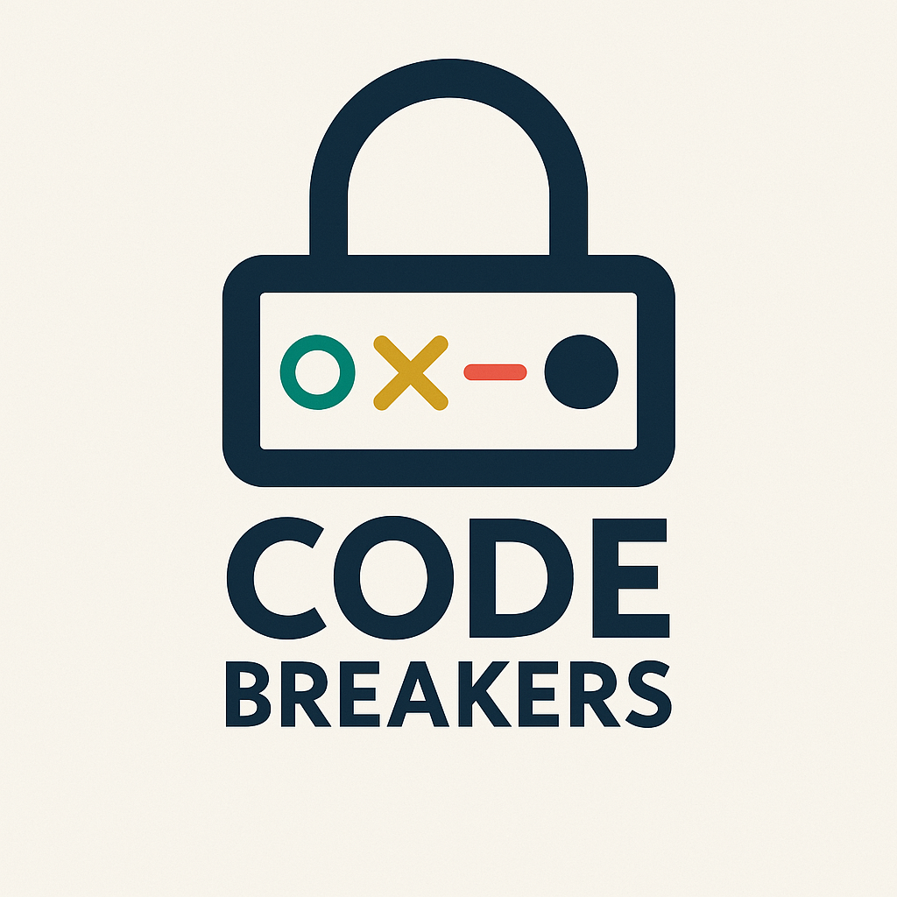

<h1 style="color: gold">The Code Breakers game!</h1>

Welcome to "The Code Breakers Game", a Python-powered application that tests your logical thinking and problem solving skills! As a player you'll have to decipher a secret code, within a limited number of attempts, using logic, deduction and feedback given each time to uncover the correct sequence of numbers. With three different difficulty modes, this game is perfect for beginners and experienced coders alike!

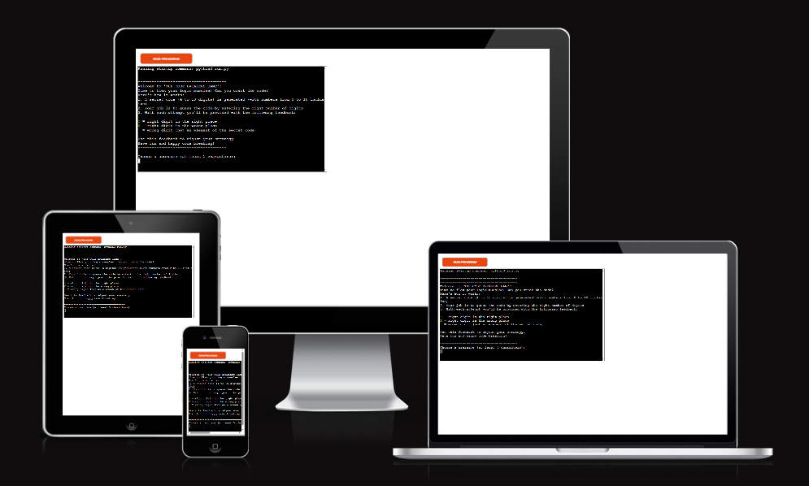
 
Link to deployed website: <a href="https://code-breakers-game-cc7884debcdc.herokuapp.com/" target="_blank">Code Breakers Game</a> 
Link to GitHub repository: <a href="https://github.com/DR-developer98/Code-Breakers-Game---3rd-CI-Portfolio-Project-Python-" target="_blank">Code Breakers Game repo</a>
<h2 style="color: darkorange">Relevant User stories</h2>

The foundation of this Web application is built on the following user stories:

<ol>
<li id="US1">As a player, I want to start the game via a simple menu, so that I can begin immediately without confusion about game options.</li>
<li id="US2">As a player, I want to receive clear feedback about how many elements are correct and in the right position, and how many are correct but in the wrong position, so that I can use logical deduction for my next attempts.
</li>
<li id="US3">As a player, I want to know how many attempts I have remaining, so that I can plan my strategy within the game’s constraints.</li>
<li id="US4">As an experienced player, I want to be able to adjust the code length and difficulty level, so that the game becomes more challenging and I can improve my skills.
</li>
</ol>

<h2 style="color: darkorange">Flowchart</h2>

For a better view of the flowchart, click <a href="assets/images-for-README/Codebreakers Game-flowchart.png" target="_blank">here</a>

<h2 style="color: darkorange">How to play</h2>

The computer generates a secret code of x numbers from 0 to 10 (included) with a length varying from 4 to 10 digits, depending on the selected mode. The player will have to guess the elements of the code, by typing the correct number of digits separated by a comma.
With each attempt, the player will be provided feedback by the computer. In the feedback, the following symbols will be used:

<strong style="color: green">O</strong> for the digits in the entered code, that are both present in the secret code and entered in the right position by the user

<strong style="color: gold">X</strong> for the digits in the entered code, that are present in the secret code but not in the right spot

<strong style="color: red">-</strong> for the digits in the entered code, that are not in the secret code.

Using the provided feedback, the player will have to make the needed adjustments to their code, in order to try and guess the secret one before they run out of attempts.

<h2 style="color: darkorange">Features</h2>
<h3>Start window</h3>

In the start window, the player will be presented with a short explanation of the game, its rules and the feedback elements.
The player will be asked to enter a username of at least 5 characters.

 
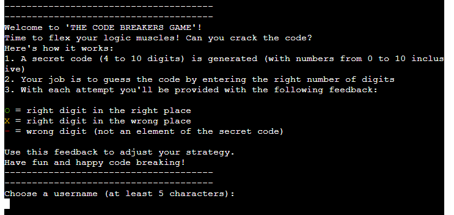
 

The username will pass through a validation system, that checks that the username:

<ul>
<li>contains the minimum number of digits;</li>
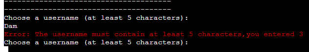
<li>doesn't contain any white spaces (this is to prevent the user from entering all blank spaces).</li>
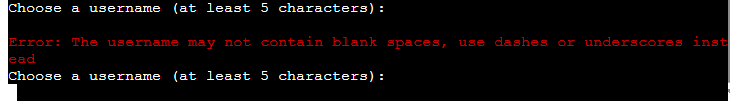
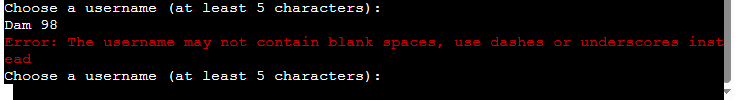
</ul>

The player will be provided feedback, if the username passes through the validator.

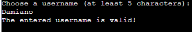

<h3>Start game/View rankings menu</h3>

After entering a valid name, the player will be presented with a short menu with two options:

<ol></ol>

<h3>Future implementations</h3>

Future implementations may include:

<ul>
<li>the possibility to include double values in the secret code to add another layer of complexity to the game;</li>
<li>setting a timer for the user code input to increase the difficulty of the game even more.</li>
</ul>

<h2 style="color: darkorange">Testing</h2>
<h3>Validator Testing</h3>
I passed the code through a PEP8 Linter and confirmed there are no problems
 
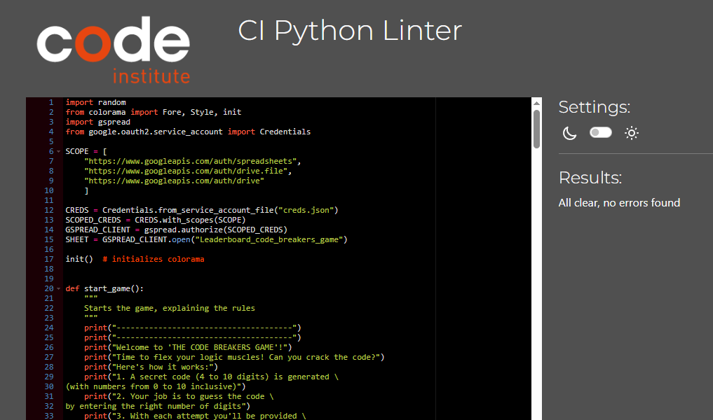
<h3>Manual testing</h3>
<table>
<tr>
<th style="color: gold">Action</th>
<th style="color: gold">Expected behaviour</th>
<th style="color: gold">Pass/Fail</th>
</tr>
</table>
<h3>Fixed bugs</h3>
<ul>
<li>The program was originating two different secret codes and was prompting the user to input their guess twice. This was caused by the generate_secret_code(mode) and input_guessed_code(gen_code, digits, attempts) being called twice. Since both functions return a tuple with three variables, I had to unpack them in order to access the variables that I had to pass as arguments to the input_guessed_code function.
At the beginning I used the following solution:</li>

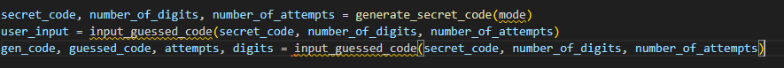

but then I understood that I was in fact calling the functions twice.
This was solved by:
1. merging the function that was handling the input of the user's guess and that, which was responsible for the validation of the entered code. The new function became check_guessed_code_against_secret_one(gen_code, digits, attempts);
2. unpacking the tuple with the returned variables from the function "generate_secret_code(mode)" (as *args) directly when defining the "feedback" variable within the "main()" function.

Tuple with returned variables from generate_secret_code function

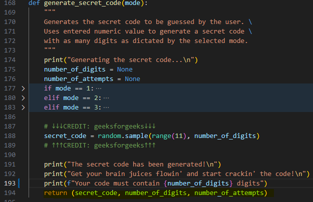

Unpacking tuple when defining feedback variable/calling check_guessed_code_against_secret_one function

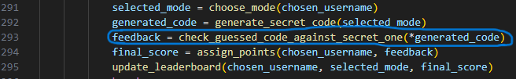

<li>At some point the program was seemingly swapping number_of_attempts with number_of_digits. This was caused by the order, in which I had mentioned the parameters inside the brackets of the check_guessed_code_against_secret_one(gen_code, attempts, digits) function, so when unpacking the tuple with the returned variables from the generated_code variable, the number_of_attempts and number_of_digits were being assigned respectively to digits and to attempts. This was simply fixed by changing the order of the parameters to (gen_code, digits, attempts).</li> 

<li>When implementing colorama to add colour to the feedback elements (O, X and -), the terminal was returning something like:</li>
 
<em>"here is your feedback: ['\x1b[32mO\x1b[0m', '\x1b[33mX\x1b[0m', '\x1b[33mX\x1b[0m', '\x1b[33mX\x1b[0m']"</em>
 
 
This was caused by the feedback being provided to the user in the form of a list of strings.
To fix this, I used the .join method like in the example here below, to turn the list into one single string, where the colours where rendered correctly. CREDIT: <a href="https://copilot.microsoft.com/" target="_blank">Microsoft Copilot</a>
 
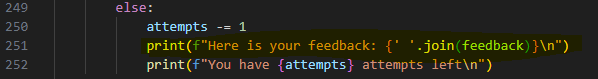
</ul>

<h2 style="color: darkorange">Deployment</h2>

This project was deployed using Code Institute's mock terminal for Heroku.

In order to deploy this game, follow these steps:

<ol>
<li>Fork or clone this repository</li>
<li>Create a new Heroku app</li>
<li>Set the buildbacks to Python and NodeJS in that order</li>
<li>Link the Heroku App to the repository</li>
<li>Click on Deploy</li>
</ol>

<h2 style="color: darkorange">Credits</h2>
<h3>Content</h3>
<ul>
<li>For the code to exclude double values in the secret code (generate_secret_code function), I consulted <a href="https://www.geeksforgeeks.org/python-random-sample-function/" target="_blank">geeksforgeeks</a></li>
 
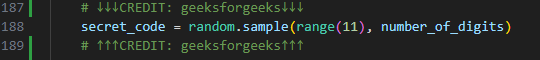
 
<li>For the code to make sure the username-score pairs from the external Leaderboard Excel-sheet be shown in decreasing order of score, I consulted <a href="https://stackoverflow.com/questions/10695139/sort-a-list-of-tuples-by-2nd-item-integer-value" target="_blank">stackoverflow</a></li>
 
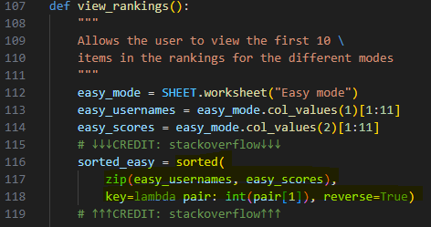
 
<li>For the validation system, that checks for unwanted letters/symbols other than numbers in the code entered by the user, I used the following solution, suggested by <a href="https://copilot.microsoft.com/" target="_blank">Microsoft Copilot</a></li>
 
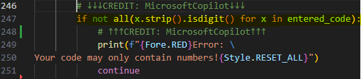
 
<li>The suggestion to use the colorama library to add colours to the error messages and the feedback components was given to me by my mentor, Dick Vlaanderen. For its correct usage in the code, <a href="https://pypi.org/project/colorama/" target="_blank">https://pypi.org/project/colorama/</a> was consulted.</li>
</ul>
<h3>Used technologies</h3>
<ul>
<li>This entire app was developed using Python</li>
<li><a href="https://copilot.microsoft.com/" target="_blank">Microsoft Copilot</a> was used to create the logo of this app (see top of this README file)</li>
</ul>
<h3>Media</h3>
All used screenshots were taken from my own laptop

