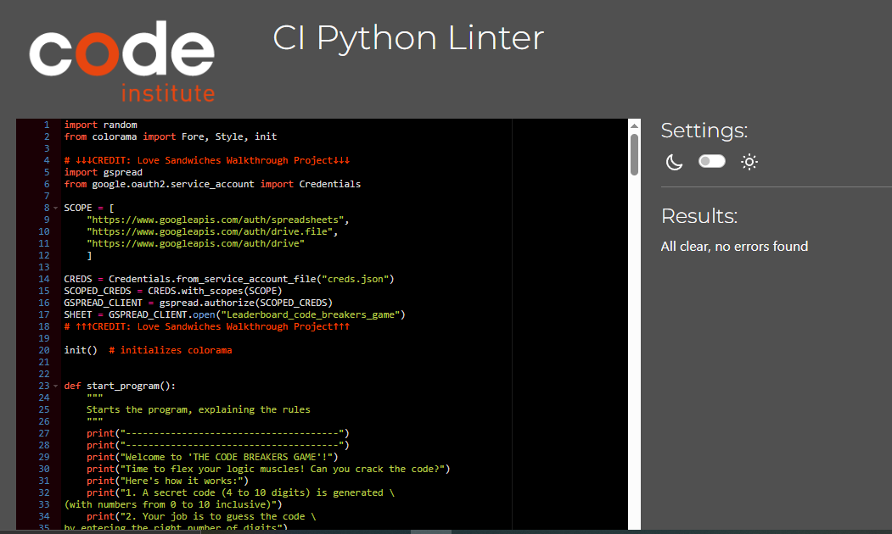
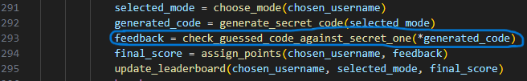
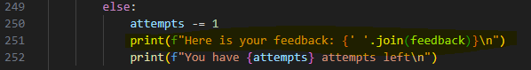

<h1 style="color: darkorange">Testing</h1>
<h2 style="color: gold">Validator Testing</h2>
I passed the code through a PEP8 Linter and confirmed there are no problems
 

 

I tested the code in my local terminal and the Code Institute Heroku terminal

<h2 style="color: gold">Manual testing</h2>
<table>
<tr>
<th style="color: orange">Action</th>
<th style="color: orange">Expected behaviour</th>
<th style="color: orange">Pass/Fail</th>
</tr>
<tr>
<td>Go to <a href="https://code-breakers-game-cc7884debcdc.herokuapp.com/" target="_blank">https://code-breakers-game-cc7884debcdc.herokuapp.com/</a></td>
<td>Open program at the start window (rules and feedback explanation + input username)</td>
<td>Pass</td>
</tr>
<tr>
<td>Enter a username of less than 5 characters</td>
<td>Program throws the following error message in red: "The username must contain at least 5 characters, you entered X" (where X is the number of entered characters). The user is prompted to enter a valid username again.</td>
<td>Pass</td>
</tr>
<tr>
<td>Enter a username of at least 5 characters</td>
<td>Program provides the feedback: "The entered username is valid!". The user is presented with a 3-item menu (1. Start the game, 2. View rankings, 3. Quit the game) and is prompted to input 1, 2 or 3.</td>
<td>Pass</td>
</tr>
<tr>
<td style="font-weight: bold">START MENU</td>
<td>-</td>
<td>-</td>
</tr>
<tr>
<td>Input something other than 1, 2 or 3.</td>
<td>Program throws error: "Invalid input. Please enter 1, 2 or 3"</td>
<td>Pass</td>
</tr>
<tr>
<td>Enter 2 (View rankings)</td>
<td>Not more than the first 10 username-score pairs for each mode are visible on the screen. At the end of the list, the start-menu is presented to the user again.</td>
<td>Pass</td>
</tr>
<tr>
<td>Enter 3 (Quit the game)</td>
<td>User is presented with the start window of the game (rules and feedback explanation) and is prompted to enter a valid username.</td>
<td>Pass</td>
</tr>
<tr>
<td>Enter 1 (Start the game)</td>
<td>The user is presentede with the mode choosing menu, where the three modes are listed, showing, inbetween brackets, the number of digits of the corresponding secret code. The user is prompted to enter 1, 2 or 3 to select the desired mode.</td>
<td>Pass</td>
</tr>
<tr>
<td style="font-weight: bold">MODE CHOOSING MENU</td>
<td>-</td>
<td>-</td>
</tr>
<tr>
<td>Enter something other than 1, 2 or 3</td>
<td>The program throws the error: "Invalid input. Please enter 1, 2 or 3". The player is prompted to enter a value again.</td>
<td>Pass</td>
</tr>
<tr>
<td>Enter 1/2/3</td>
<td>The program shows the following text: "Generating the secret code..."
"The secret code has been generated!"
"Get your brain juices flowin' and start crackin' the code"
"Your code must contain 4/6/10 digits"
"You have a maximum of 4/6/10 attempts".
At the end the game prompts the user to enter a code of the correct digits, separated by a comma.</td>
<td>Pass</td>
</tr>
<tr>
<td style="font-weight: bold">ACTUAL GAME</td>
<td>-</td>
<td>-</td>
</tr>
<tr>
<td>Enter a code containing at least one non-numeric value (letters, symbols, etc...)</td>
<td>The program throws the following error: "Your code may only contain numbers!"</td>
<td>Pass</td>
</tr>
<tr>
<td>Enter numbers outside of the scope 0-10</td>
<td>The following error message is shown: "The code may only contain numbers from 0 to 10"</td>
<td>Pass</td>
</tr>
<tr>
<td>Enter a code with an incorrect number of digits</td>
<td>The program throws the error: "In this mode you need to provide 4/6/10 digits, you've entered X" (where X is the number of actually entered digits by the player)</td>
<td>Pass</td>
</tr>
<tr>
<td>Enter a code in the correct format, which is different to the secret code</td>
<td>The program provides the feedback: "The number of digits is correct!". The user is presented with a feedback (f.e "--OO", if the last two digits are elements of the secret code and entered in the right position, while the first two aren't present in the secret code at all). The number of attempts is lowered by 1 and the user is prompted to enter another guess.</td>
<td>Pass</td>
</tr>
<tr>
<td>Enter a code equal to the secret code</td>
<td>The program provides the feedback: "The number of digits is correct!"
"Congratulations! You've cracked the code!"
"{username}, this is your score: {left_attempts}*50"
"{username}, you've been succesfully added to the leaderboard!".
Below the feedback, the user is presented with the start-menu again.</td>
<td>Pass</td>
</tr>
<tr>
<td>Enter a wrong guess when number of attempts is equal to 0</td>
<td>The program provides the following feedback: "Unfortunately, you're out of attempts :(."
"The secret code is: {secret_code}"
"Don't worry, though! You'll get the hang of it ;)"
"{username}, this is your score: {left_attempts}*50"
"{username}, you've been succesfully added to the leaderboard!".
Below the feedback, the user is presented with the start-menu again.</td>
<td>Pass</td>
</tr>
<tr>
<td>Enter "1" from start-menu after end-of-game-feedback</td>
<td>Redirect user to mode-choosing menu</td>
<td>Pass</td>
</tr>
<tr>
<td>Enter "2" from start-menu after end-of-game-feedback</td>
<td>Load rankings</td>
<td>Pass</td>
</tr>
<tr>
<td>Enter "3" from start-menu after end-of-game-feedback</td>
<td>Redirect user to start window (rules + feedback explanation + prompt to enter username)</td>
<td>Pass</td>
</tr>
</table>
<h2 style="color: gold">Fixed bugs</h2>
<ul>
<li>The program was originating two different secret codes and was prompting the user to input their guess twice. This was caused by the generate_secret_code(mode) and input_guessed_code(gen_code, digits, attempts) being called twice. Since both functions return a tuple with three variables, I had to unpack them in order to access the variables that I had to pass as arguments to the input_guessed_code function.
At the beginning I used the following solution:</li>

but then I understood that I was in fact calling the functions twice.
This was solved by:
1. merging the function that was handling the input of the user's guess and that, which was responsible for the validation of the entered code. The new function became check_guessed_code_against_secret_one(gen_code, digits, attempts);
2. unpacking the tuple with the returned variables from the function "generate_secret_code(mode)" (as *args) directly when defining the "feedback" variable within the "main()" function.

Tuple with returned variables from generate_secret_code function

Unpacking tuple when defining feedback variable/calling check_guessed_code_against_secret_one function

<li>At some point the program was seemingly swapping number_of_attempts with number_of_digits. This was caused by the order, in which I had mentioned the parameters inside the brackets of the check_guessed_code_against_secret_one(gen_code, attempts, digits) function, so when unpacking the tuple with the returned variables from the generated_code variable, the number_of_attempts and number_of_digits were being assigned respectively to digits and to attempts. This was simply fixed by changing the order of the parameters to (gen_code, digits, attempts).</li> 

<li>When implementing colorama to add colour to the feedback elements (O, X and -), the terminal was returning something like:</li>
 
<em>"here is your feedback: ['\x1b[32mO\x1b[0m', '\x1b[33mX\x1b[0m', '\x1b[33mX\x1b[0m', '\x1b[33mX\x1b[0m']"</em>
 
 
This was caused by the feedback being provided to the user in the form of a list of strings.
To fix this, I used the .join method like in the example here below, to turn the list into one single string, where the colours where rendered correctly. CREDIT: <a href="https://copilot.microsoft.com/" target="_blank">Microsoft Copilot</a>
 

</ul>